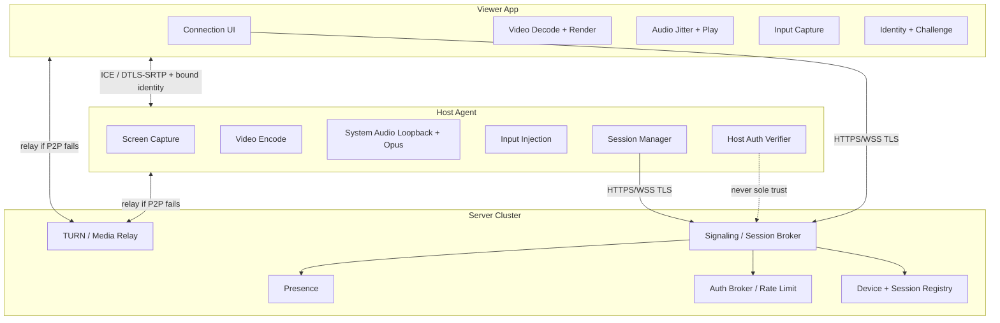
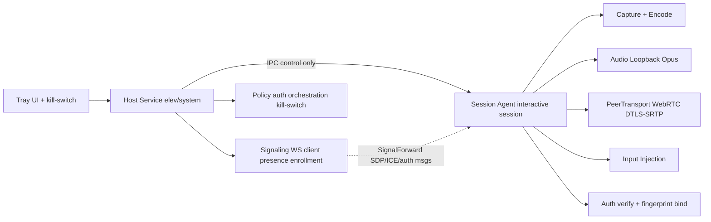
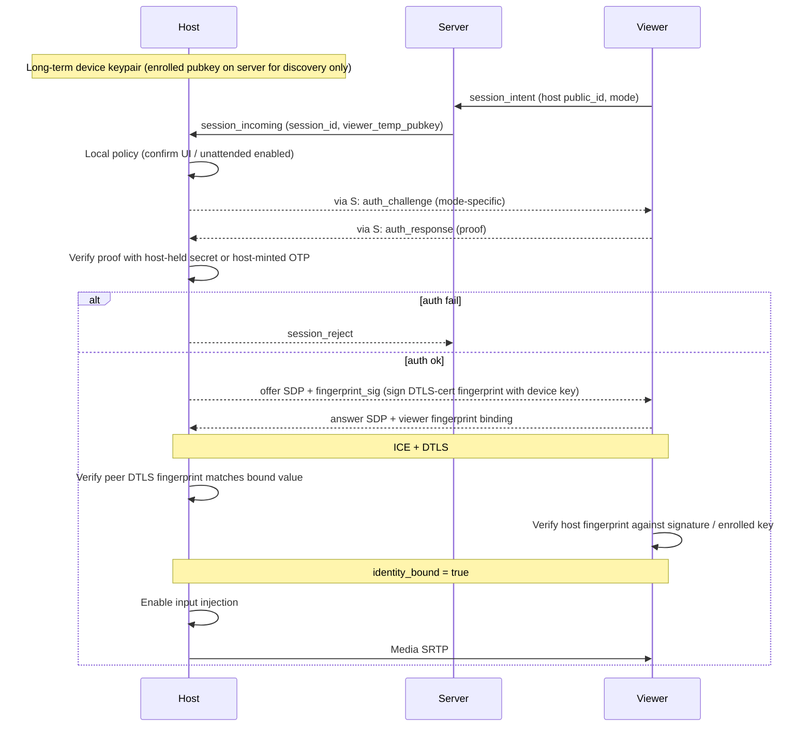
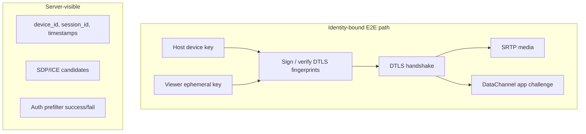
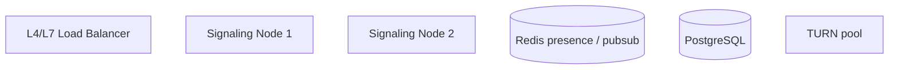

# RemoteLink — Design Document

| Field | Value |
|--------|--------|
| **Title** | RemoteLink: Low-Latency Remote Desktop with System Audio |
| **Author** | Systems Architecture (draft) |
| **Date** | 2026-08-06 |
| **Revised** | 2026-08-06 (review cycle 2) |
| **Status** | Draft |
| **Working name** | RemoteLink |
| **Product type** | Greenfield remote control suite (host agent + viewer + signaling/relay server) |
| **Staffing assumption** | 2–3 engineers, ~6–9 months to Windows-only closed beta; agents and Linux host post-beta or parallel part-time |

---

## Overview

RemoteLink is a greenfield remote-desktop product focused exclusively on the core connection loop: **screen capture, remote input control, and synchronized system audio** from the host machine to a viewer client. It deliberately excludes secondary AnyDesk-like features (file transfer, in-app chat, whiteboard, multi-session management UI polish) from v1 scope so engineering effort concentrates on interactive latency, reliable NAT traversal, correct A/V sync, and a **host-centric authorization model** that does not treat the signaling server as sole root of trust for control.

The system comprises three deployable applications and a shared protocol/media monorepo: a **Host agent** that captures display and system audio and injects input; a **Viewer client** that renders video, plays audio, and sends input events; and a **Server** that handles identity registry, session brokerage (signaling), optional media relay (TURN), and presence. Transport is WebRTC-first (DTLS-SRTP, ICE) with **identity binding** so a compromised signaling server cannot MITM media or enable input without host-held secrets. A multi-agent testing architecture inventorizes public APIs and opens draft test PRs; CI only runs **checked-in** tests, with hand-written coverage required on protocol/auth/media from day one.

**v1 staffing/feasibility cut:** Windows host + Windows/macOS/Linux viewer + single-node self-hosted server via docker-compose first; multi-agent automation and Linux host are valuable but must not block closed beta (see Goals G6–G7 phasing and Non-goals).

---

## Background & Motivation

### Why this product

Remote support, home-lab access, and “control my other PC” workflows still suffer from:

- High latency or soft-input feel on commodity WAN links  
- Missing or broken **system audio** (many tools capture mic only, not loopback)  
- Opaque relay or signaling servers that can MITM if identity is not bound  
- Heavy clients bundling unrelated features that increase attack surface  

AnyDesk, TeamViewer, and Chrome Remote Desktop demonstrate market fit; RemoteLink targets a **minimal, security-conscious, latency-first** alternative with explicit audio-first design and open, testable architecture.

### Current state

This is a **greenfield** design. The workspace `english-school-app` (Node/Express school management) is unrelated and must not constrain stack, packaging, or APIs. RemoteLink is a **new monorepo** (`remotelink/`) with its own CI, release channels, and threat model—verified separate from school-app code.

### Pain points the design addresses

| Pain | Design response |
|------|------------------|
| Soft input / high RTT | WebRTC UDP, hardware encode, input coalescing; separate glass-to-glass and input-loop targets |
| No host speakers on remote | First-class loopback capture (WASAPI / Pulse monitor) + Opus |
| NAT / corporate firewalls | ICE + STUN + optional TURN; server never required on media path when P2P works |
| Unclear trust model | Host-side auth for control; DTLS fingerprint binding; server brokers only |
| Sparse automated quality | Hand tests early + multi-agent inventory/draft tests + chaos in nightly CI |

---

## Goals & Non-Goals

### Goals (measurable)

Latency metrics are defined in **Latency metrics (definitions)** below. Do not conflate them.

| ID | Goal | Metric / acceptance |
|----|------|---------------------|
| G1 | Interactive remote control on LAN | **Glass-to-glass** video ≤ 50 ms p95; **input-to-glass** ≤ 80 ms p95 (LAN profile: HW encode, jitter target 10–15 ms, vsync-off present option) |
| G2 | Usable WAN remote control | Glass-to-glass ≤ 80 ms p95; input-to-glass ≤ 120 ms p95 on 50 Mbps / 30 ms RTT; glass-to-glass ≤ 120 ms / input-to-glass ≤ 180 ms on 10 Mbps / 80 ms RTT |
| G3 | System audio fidelity | Host mix → viewer continuous playback; A/V skew ≤ 40 ms after jitter buffer stabilize; Opus 48 kHz stereo (mono optional); **skew metric required in all beta builds** (HUD or exportable stats) |
| G4 | Connectivity success | ≥ 95% sessions establish without manual port-forward (P2P or relay) under the **NAT mix test plan** (see Scaling) |
| G5 | Session security | All media DTLS-SRTP; **identity-bound** peers; control plane TLS 1.3; host authorizes every session; no plaintext secrets at rest |
| G6 | Cross-platform core | **Closed beta:** Windows host + Windows/macOS/Linux viewer; **GA candidate:** + Linux host secondary. macOS host deferred |
| G7 | Testability | Hand-written unit tests for protocol/auth/media from PR2+; agents draft additional coverage; coverage gates after agent baseline; nightly bug-hunt |
| G8 | Operational simplicity | Single-node signaling for ≤ 10k concurrent **presence connections** on reference hardware (see Scaling); horizontal path documented |
| G9 | Session visibility (security UX) | **Mandatory** host connection indicator + local kill-switch while controlled (GA acceptance) |

### Non-goals (explicitly out of scope for v1)

- Full AnyDesk/TeamViewer feature parity  
- **Clipboard sync** — strict non-goal for v1 (security-sensitive; revisit v1.x)  
- File transfer, chat, whiteboard  
- Multi-monitor advanced layouts (v1: **one** selected display stream; `display_id` reserved in protocol for later)  
- Mobile viewers (iOS/Android); web viewer  
- Unattended mass fleet management / MDM / RMM  
- Recording sessions to disk as a product feature  
- Built-in VPN or reverse proxy productization  
- GPU cloud encoding farms; SFU-by-default  
- Plugin marketplace or third-party SDK  
- Agent-generated GUI pixel tests or real DXGI inside agent sandbox  
- Multi-viewer concurrent control of one host (v1: **single active controller**)

### Staffing & schedule assumption

Aligned with **Rollout Plan** and **PR Plan** (identity binding before real input; Windows media can dogfood view-only after bind work starts).

| Milestone | Scope | Rough timing (2–3 eng) | Maps to |
|-----------|--------|-------------------------|---------|
| M0 | Protocol, auth, server, synthetic media traits | Months 0–2 | Rollout 0; PR 1–7, 9 |
| M1 | WebRTC spike go/no-go + synthetic host/viewer E2E | Months 2–3 | Rollout 1; PR 8–12 |
| M2 | **Identity binding + OTP/unattended policy** + synthetic bind e2e | Months 3–4.5 | Rollout 2; PR 13–15 |
| M3 | Windows capture/encode/audio + viewer real decode (view-only until input PRs) | Months 4.5–6.5 | Rollout 3; PR 10 (if not earlier), 16a–c, 17 |
| M4 | **Input after bind** + session chrome + closed beta hardening, TURN chaos, packaging | Months 6.5–9 | Rollout 4–5; PR 18–21, 26 |
| Post-beta | Linux host, agents coverage gates, self-host polish | Months 9+ | Rollout 6; PR 22–25, 27 |

**Note:** Media-without-input (view-only) is allowed for dogfood during M3 **only if** PR 13 identity path already exists for the eventual control path; **input injection remains gated on bind** (PR 18 depends on PR 13/15). Do not schedule M3 “full remote control” before M2.

If staffing is 1 engineer, cut Linux host and agents to post-GA; keep hand tests + fuzz targets only.

---

## Proposed Design

### High-level architecture



**Media path preference:** direct peer-to-peer (host ↔ viewer) via ICE. Server is on the media path only when candidates require relay. **Authorization path preference:** host verifies viewer proof using host-held or host-minted secrets; server rate-limits and brokers but is **not** sole authorizer for input enablement.

### Latency metrics (definitions)

| Metric | Definition | Measurement harness |
|--------|------------|---------------------|
| **Glass-to-glass** | Time from host frame capture timestamp → viewer first pixel present of that frame | Synthetic: encode frame index in pixel row / QR; viewer reads index vs host monotonic map |
| **Capture-to-present** | Same as glass-to-glass excluding intentional viewer jitter buffer hold beyond minimum | Report both raw and post-jitter |
| **Input-to-glass** | Time from viewer `InputEvent.client_ts` (send) → host inject → OS/compositor reaction visible in a subsequent captured frame → that frame presented on viewer | Synthetic: host draws last-received input sequence id into overlay; viewer matches |
| **Input one-way** | Viewer send → host inject callback | Mock `InputSink` timestamp; no display |

**LAN profile for G1:** HW H.264, 1080p60 where available, video jitter target **10–15 ms**, prefer present without waiting for display vsync when “low latency” mode on, Opus 10 ms, absolute mouse.

### Latency budget (one-way video glass-to-glass, good WAN ~15 ms one-way)

| Stage | Budget |
|-------|--------|
| Capture + copy | 4–8 ms |
| Encode | 4–12 ms (HW) |
| Network one-way | ~15 ms (WAN) / ~1 ms (LAN) |
| Jitter buffer (video) | 10–15 ms LAN profile; 20–40 ms WAN default |
| Decode + present | 4–10 ms |
| **Total glass-to-glass** | **LAN ~25–50 ms; WAN ~50–85 ms** typical |

**Input-to-glass** ≈ input one-way (DataChannel + inject, ~1–5 ms LAN) + host reaction (1–16 ms frame) + glass-to-glass of the reaction frame. Hence G1 input-to-glass **≤ 80 ms** on LAN (not 40 ms full loop). Older “≤40 ms input-to-glass” wording is **retired** as inconsistent with jitter + full control loop.

### Bandwidth budgets (defaults, adaptive)

| Stream | Typical | Cap (default profile) |
|--------|---------|------------------------|
| Video 1080p30 | 2–6 Mbps | 8 Mbps |
| Video 1080p60 (LAN) | 6–12 Mbps | 15 Mbps |
| Audio Opus stereo | 64–96 kbps | 128 kbps |
| Input/control | < 50 kbps | Cap 200 events/s host-side |

Congestion control: WebRTC GCC / transport-cc; host encoder bitrate follows estimated bandwidth; resolution/FPS ladder (1080p60 → 1080p30 → 720p30 → 540p30).

### Component responsibilities

#### 1. Host app (`apps/host`)

Runs as a privileged user-mode service + tray UI (Windows: service + session agent for interactive desktop; Linux: systemd user/system unit as appropriate).

| Subsystem | Responsibility |
|-----------|----------------|
| **Screen capture** | DXGI Desktop Duplication (Windows); PipeWire/X11/Wayland portals (Linux). Frames tagged with host monotonic capture time. |
| **Video encode** | Prefer hardware H.264 (NVENC / Quick Sync / AMF); software fallback. Keyframe on scene change / PLI / reconnect / display change. |
| **System audio** | WASAPI loopback shared mode + `AUDCLNT_STREAMFLAGS_LOOPBACK` (Windows); PipeWire/Pulse monitor (Linux). |
| **Input injection** | Enabled **only after** identity bind + session auth succeed. Windows: `SendInput`; Linux: uinput/libei/XTest. |
| **Session lifecycle** | Register, presence, accept/reject, renegotiate on display change, teardown (service + agent). |
| **Auth verifier** | Host-side OTP/password/PAKE verification; local accept UI when policy requires (agent + service policy). |
| **Session UX** | Mandatory connection chrome, kill-switch hotkey, single-controller lock. |
| **NAT / media plane** | **PeerTransport (WebRTC) runs in the session agent** with capture/encode (KD5); ICE host/srflx/relay. |

**Host process model (Windows) — agent-media (chosen default):**



| Process | Owns | Does **not** own |
|---------|------|------------------|
| **Host Service** (Session 0 / elevated) | Device enrollment, long-lived **signaling WebSocket** to server, presence/heartbeat, server-driven feature flags, OTP mint API calls, **kill-switch orchestration**, session policy, spawning/attaching session agent, tray coordination | DXGI/WASAPI, encode, `PeerTransport`, RTP/SRTP, input inject |
| **Session Agent** (interactive user session) | Screen capture, audio loopback, H.264/Opus encode, **`PeerTransport` (ICE/DTLS-SRTP/DataChannel)**, RTCP PLI/FIR → encoder bitrate (in-process), identity bind crypto, input inject after bind, session chrome in-desktop | Outbound device registry WS (receives forwarded signaling via IPC) |

**Why agent-media (not service-media):** DXGI and WASAPI must run in the interactive session; putting encode + WebRTC in the **same process** avoids multi‑Mbps NALU/PCM over IPC, avoids extra glass-to-glass latency in G1 budgets, and keeps PLI/FIR/GCC → encoder feedback **in-process** (no extra RTT). Service remains the stable process across Fast User Switching and owns the always-on control plane.

**Rejected alternative (service-media):** PeerConnection in the service with `PushVideoNalu` / `PushAudioFrame` / `OnRtcpFeedback` over IPC — only revisit if agent cannot open sockets under corporate lockdown; would require framing, backpressure, shared `t0`, and explicit +2–8 ms IPC budget (not v1 default).

**IPC is control-plane only** (no media bytes). Authenticated local pipe (ACL + shared secret per boot). See **Host local IPC** for method catalog.

Session agent runs in the interactive user session so DXGI/WASAPI and input work under Fast User Switching.

**Secure desktop / UAC (v1 known gap):** Capture and injection **do not work on Winlogon/UAC secure desktop** without a separate signed path (e.g. credential provider / special driver)—**out of scope for v1**. Document: remote user cannot interact with UAC prompts or Ctrl+Alt+Del secure desktop; host user must complete those locally. Tray kill-switch remains available on normal desktop.

#### 2. Client / Viewer app (`apps/viewer`)

**GUI toolkit (KD13):** **egui + winit** for v1 speed; viewer-core library remains toolkit-agnostic (render surface + input callbacks) so PR “viewer-core” does not hard-block on UI polish.

| Subsystem | Responsibility |
|-----------|----------------|
| **Connection UI** | Host public ID + password or OTP; recent connections; mute; disconnect. |
| **Video pipeline** | RTP H.264 → decode → present; drop late frames; PLI/FIR on loss. |
| **Audio pipeline** | Opus → jitter buffer → playout; skew controller (see A/V timing contract). |
| **Input** | Capture mouse/keyboard; normalized coords; DataChannel send with rate limit. |
| **Stats HUD** | **Required in beta** (toggleable): RTT, bitrate, FPS, loss, **A/V skew**, identity-bind status. Optional in GA consumer UI; always in advanced menu. |
| **Identity** | Ephemeral viewer keypair per session (or stored pairing key later); prove knowledge of password/OTP material as specified per mode. |

#### 3. Server (`apps/server`)

| Subsystem | Responsibility |
|-----------|----------------|
| **Signaling** | WSS: SDP/ICE relay, session control; **does not** enable host input by assertion alone. |
| **Session broker** | Match viewer → host presence; create session; TTL; **single active session** per host (busy reject). |
| **Device registry** | Public IDs, public keys, optional server-side password **verifier** for ad-hoc mode, credentials. |
| **Presence** | WS primary; Redis TTL; reconnect storm handling. |
| **TURN** | coturn; **session-scoped** time-limited credentials. |
| **Auth broker** | Rate limits, OTP hash store (when used), audit; optional server password check as **pre-filter only**. |
| **Admin** | Health, metrics, force-disconnect, feature flags, blocklist. |

### Trust model & identity binding (signaling MITM defense)

Classic WebRTC risk: a malicious signaling server substitutes SDP `a=fingerprint` and MITMs DTLS, decrypting media and injecting input. RemoteLink **requires** identity binding before input is enabled.



**Rules:**

1. Each peer uses a DTLS certificate (ephemeral per session or stable).  
2. Host signs its DTLS fingerprint (and session_id) with the **enrolled device private key**; viewer verifies with enrolled public key (fetched over TLS from server **or** pinned from prior pairing—server could serve wrong key: mitigate by **TOFU** on first local confirm and optional out-of-band ID check).  
3. For stronger binding: after DTLS connects, run an **application-level challenge** over DataChannel: host sends nonce; viewer proves session auth material; both channel-bind `session_id || fingerprint_host || fingerprint_viewer`.  
4. **Host MUST NOT accept input** until `identity_bound && session_authorized`. Media may start earlier for “connecting…” preview only if product allows; default **v1: no input, optional blank video until bound**.  
5. **Residual trust:** Server can still DoS, lie about presence, and serve wrong enrolled public keys on first connect without TOFU. Local confirm + displaying host key fingerprint/short SAS in UI reduces TOFU risk. Password-only server-side gate **without** host verify is **rejected** for unattended control.

### Session authorization modes (split clearly)

| Mode | UX | Where secret lives | Server role | Host role |
|------|-----|--------------------|-------------|-----------|
| **A — Ad-hoc OTP** | Support: host shows 6–8 digit code | Host mints OTP; stores **hash** on server with TTL **or** verifies only on host | Rate-limit; optional store `otp_codes` hash; bind to `session_intent_id` | Generate OTP; verify response (preferred: host verifies plaintext code entered by viewer after server only checks “code exists and not expired” pre-filter) |
| **B — Unattended** | Silent or notify-only | **Host-only** long-term secret (or PAKE verifier); never stored as reverseable password on server | Brokers challenge messages; stores **no** unattended password | Challenge-response / PAKE (e.g. SPAKE2+ or custom: server-visible transcript only); local policy |
| **C — Server-checked password (optional)** | Familiar “password to server” | Argon2id **hash on server** | Verifies password as **pre-filter**; still requires mode A/B host bind for input | Still requires fingerprint bind; may additionally require local confirm |

**Default v1 product policy:**

- Unattended → **Mode B only** (challenge-response; server never has unattended secret).  
- Ad-hoc support → **Mode A** (host-minted OTP).  
- Mode C optional for enterprise “directory password” experiments; **not** sufficient alone for input enablement.

**OTP sequence (Mode A):**

1. Host user clicks “Allow remote” → host generates OTP `c`, stores `hash(c)` + `expires_at` + `host_device_id` via authenticated host API; shows `c` on screen.  
2. Viewer creates `session_intent` with `host_public_id` + OTP `c`.  
3. Server looks up unexpired unconsumed hash, rate-limits, marks **pending** bind to `session_intent_id` (atomic compare-and-set on consume).  
4. Host receives `session_incoming`; **re-validates** OTP (either recompute against host-side copy of active OTP window, or server sends “otp_ok_prefilter” and host still checks active code).  
5. On success, consume OTP **once** (`consumed_at` set in same DB transaction as session active); double consume → reject.  
6. Lockout: Redis `auth_fail:{host}:{ip}` and `auth_fail:{host}` counters; exponential backoff.

**Unattended (Mode B):**

1. Host stores `K` only locally (DPAPI/keyring).  
2. Viewer sends connect intent; server forwards.  
3. Host sends `auth_challenge` = random nonce `n`.  
4. Viewer proves knowledge of shared secret derived at pairing (or user types unattended password; proof = `MAC_K(session_id||n||fingerprints)` computed on viewer after user entry—password still not sent to server).  
5. Host verifies MAC; then proceeds to fingerprint-signed SDP.

### Session lifecycle (sequence)

```mermaid
sequenceDiagram
  participant H as Host
  participant S as Server
  participant V as Viewer

  H->>S: hello (device credential, protocol_version)
  S-->>H: ok + server_config (STUN/TURN template, feature flags)

  V->>S: hello (viewer session token or anonymous)
  V->>S: session_intent (host_public_id, mode, auth material prefilter)
  S->>S: rate-limit; single-session lock check
  S->>H: session_incoming
  H->>V: auth_challenge (via S)
  V->>H: auth_response (via S)
  H->>H: authorize + optional local UI confirm
  H-->>S: session_accept or session_reject
  H->>V: session_offer (SDP + fingerprint_sig)
  V->>H: session_answer (SDP)
  Note over H,V: ICE; DTLS; verify fingerprints; DataChannel bind
  H->>H: enable_input = true
  H->>V: media
  V->>H: input (only accepted if enable_input)

  Note over H,V: display change → renegotiate (new offer/answer, keyframe)
  V->>S: session_end / H local kill-switch
  S->>S: teardown; release single-session lock
```

**Role convention:** Host is the **offerer**; Viewer is the **answerer**.  
**Display change:** Host detects topology/resolution change → pause inject → new offer with updated track params → keyframe → resume.  
**Single controller:** If session active, new intents get `session_reject reason=busy` until end.

### Protocols & tech stack

| Layer | Choice | Rationale |
|-------|--------|-----------|
| Signaling | HTTPS + WSS (JSON/protobuf) | Firewall-friendly |
| Media | WebRTC RTP/SRTP/RTCP | ICE, congestion, tooling |
| Video | H.264 | HW ubiquity on Windows |
| Audio | Opus 48 kHz, 10 ms frames preferred | Latency |
| Input | DataChannel; partial reliability on moves | Avoid HOL |
| Language | **Rust** monorepo | Safety + shared crates |
| WebRTC | **Spike-gated** (see KD-stack / PR 8) | Do not assume pure-Rust HW path works |
| TURN | coturn | Battle-tested |
| DB | PostgreSQL + Redis | Durable + ephemeral |
| Deploy v1 | **docker-compose self-host first** (KD16) | Operator ownership |

#### WebRTC stack decision process (not pre-settled)

Open until PR 8 **go/no-go** report is merged. Evaluation matrix:

| Criterion | webrtc-rs | str0m | libwebrtc (FFI) |
|-----------|-----------|-------|-----------------|
| ICE + DTLS-SRTP | Yes | Partial/evolving | Yes |
| H.264 packetization + NALU from external NVENC | Spike | Spike | Mature |
| DataChannel partial reliability | Check | Check | Yes |
| ICE restart | Check | Check | Yes |
| Binary size / build complexity | Smaller | Smallest | Large |
| GCC → external encoder bitrate | Custom glue | Custom glue | Existing hooks |

**PR 8 deliverable:** written spike report + selected stack as resolved Key Decision update.  
**Plan B crate boundary:** `packages/net` trait `PeerTransport`; `packages/net-webrtc-rs` vs `packages/net-libwebrtc` behind feature flags. Host encode pipeline always produces Annex-B/AVCC NALUs consumed by the transport’s packetizer—encoder **not** owned by browser-internal capturer.

### Encryption model



- **Media confidentiality:** DTLS-SRTP; TURN relays opaque packets.  
- **Media authenticity vs MITM:** fingerprint binding + optional DC challenge (above). Without binding, “E2E” claim is **false** against malicious signaling—doc no longer claims E2E solely from SRTP.  
- **Signaling:** TLS 1.3; certificate pinning optional for host/viewer to known server.  
- **Secrets:** Mode B secrets host-only; Mode A OTP short-lived; Mode C Argon2id on server.

### A/V timing contract

#### Clock domains

| Clock | Use |
|-------|-----|
| `host_mono` | `QueryPerformanceCounter` / `CLOCK_MONOTONIC` at capture and audio packetize |
| RTP video timestamp | 90 kHz; derived from `host_mono` with fixed epoch at session start (`rtp_ts = (host_mono - t0) * 90_000`) |
| RTP audio timestamp | 48 kHz; **same `t0` epoch** so initial A/V offset is zero at first keyframe + first audio frame after session media start |
| RTCP SR | Sender reports for both tracks; viewer estimates mapping to playout |

Audio and video use **separate RTP timestamps with a shared epoch `t0`**, not one RTP clock. Skew is computed in wall/playout domain:

```text
skew_ms = audio_playout_host_equiv_ms - video_present_host_equiv_ms
// positive => audio ahead of video
```

#### Host capture → RTP

1. Video frame: `capture_ts = host_mono`; encode; packetize with `rtp_ts_video(capture_ts)`.  
2. Audio: WASAPI delivers packets with own position; map to `host_mono` using `IAudioClock` / buffer offsets; Opus frame 10 ms; `rtp_ts_audio`.  
3. On media restart (device change), reset `t0` and signal `media_restart` to viewer.

#### Viewer playout defaults

| Parameter | Default |
|-----------|---------|
| Audio jitter target | 20–40 ms (WAN); 15–25 ms (LAN) |
| Video jitter target | 20–40 ms (WAN); 10–15 ms (LAN low-latency) |
| Sync mode | **Slave audio to video** (UI sounds ↔ cursor) |
| Max audio time-stretch | ±2% via **linear resample** (v1; WSOLA optional later if artifacts) |
| Skew deadband | ±15 ms (no adjust inside) |
| Skew control | Step adjust playout delay 5 ms steps toward zero at ≤10 ms/s; not full PID in v1 |
| Video freeze > 200 ms | **Hold** last audio 100 ms then **fade to silence** (default); config `audio_on_video_freeze = hold_fade \| duck \| continue` |
| Underrun | Insert silence; do not stretch beyond max |

#### Windows audio capture specifics

- Use **shared mode** `IAudioClient` with `AUDCLNT_STREAMFLAGS_LOOPBACK` on the selected render device’s endpoint.  
- Subscribe to device-change notifications (`IMMNotificationClient`); on default device change: stop client, reopen, emit `media_restart`, brief mute (<200 ms).  
- Exclusive-mode games: if loopback yields silence or client open fails, surface host tray warning + viewer banner; do not crash session. Detection: sustained near-zero energy while session active and Windows reports exclusive mode where observable.

#### PR acceptance (media)

- **PR 9:** synthetic PTS contract unit tests (skew controller, epoch mapping, shared `t0`).  
- **PR 15:** synthetic e2e asserts skew within G3 after settle (tone bursts + frame index).  
- **PR 16c + PR 17:** real WASAPI loopback + viewer playout; measure skew; G3 gate in beta (HUD/export required).

### Input path (v1 freeze)

**Coordinate space:** normalized `x,y ∈ [0.0, 1.0]` over the **selected capture rectangle** (single display in v1). Host maps to physical pixels with DPI awareness. Field `display_id` present, always `0` in v1.

**Key encoding:** Windows host injects **scan set 1** scancodes (+ extended flag); viewer maps from platform key events to scancodes via a shared table in `packages/protocol` (not Unicode chars for key-down/up). Layout: host OS layout wins; viewer does not send characters for shortcuts.

**Key repeat:** **Viewer-generated** repeats (OS repeat while held) sent as additional KeyEvents; host does not auto-repeat.

**Mouse buttons:** left, right, middle, x1, x2.  
**Wheel:** high-resolution if available (`precise_delta`); else line notches.

**Reliability:**

- Mouse move: unordered, max-retransmits=0, coalesce on viewer to ≤ 60–120 Hz.  
- Buttons/keys/wheel: reliable ordered.

**Host limits:** max **200 events/s** applied; excess dropped with metric `input_drop_rate`. Coalesce moves on host if queue depth > N.

**Focus:** Viewer sends input only when window focused (default); optional “always capture” with warning.

```protobuf
message InputEvent {
  uint64 client_ts_us = 1;
  uint32 seq = 2;
  oneof payload {
    MouseMove mouse_move = 3;
    MouseButton mouse_button = 4;
    MouseWheel mouse_wheel = 5;
    KeyEvent key = 6;
  }
}
message MouseMove {
  float x = 1; // 0..1
  float y = 2;
  uint32 display_id = 3; // v1: 0
}
message KeyEvent {
  uint32 scancode = 1;
  bool extended = 2;
  bool pressed = 3;
  uint32 modifiers = 4; // bitflags ctrl/alt/shift/meta
}
```

### Identity & pairing (product)

- **Device public ID:** **numeric + check digits** (KD14), human-friendly, not secret.  
- **Enrollment:** host generates ed25519 (or similar) device keypair; server stores public key + device row; host receives long-lived **device credential** (refreshable).  
- Modes A/B/C as above.  
- Unattended: explicit enable; session toast; kill-switch.

### Remote-control security UX (mandatory)

| Control | Requirement |
|---------|-------------|
| **Connection indicator** | Host shows non-dismissible tray state + **colored border or top bar** while session active (GA); cannot be remote-disabled |
| **Kill-switch** | Global hotkey (configurable, default e.g. Ctrl+Alt+Shift+End) handled in host service/agent **before** inject path; disconnects session and optionally disables unattended |
| **Single controller** | One active viewer session; busy reject |
| **Local confirm** | Default for first unattended enable and for Mode A; Mode B can notify-only if configured |
| **Screensaver** | Host may inhibit screensaver while session active (configurable, default on) |
| **Secure desktop** | Documented limitation (see Host) |
| **Blocklist** | Server API to block viewer fingerprints / IPs / device IDs from connecting to a host |

### Scaling model



| Scale stage | Architecture |
|-------------|----------------|
| **Single node** | Signaling + API + local coturn; Postgres |
| **Growth** | Stateless signaling + Redis pub/sub to host’s node; shared Postgres; TURN fleet |
| **Large** | Regional signaling + geo-DNS TURN |

**Reference capacity (G8):** single signaling node **4 vCPU / 8 GB RAM**, ~**5–10k** concurrent WS presence connections, average **0.1 msg/s** idle presence + spikes at connect; **not** media. Assume 500 B/msg average.

**Presence:** Redis key `presence:{device_id}` → `{node_id, exp}`; TTL **30s** refreshed every 10s over WS. On node death: hosts reconnect, re-register; viewers in-flight sessions fail until ICE/media survives (media independent) but signaling control may drop—clients treat signaling disconnect as soft warning if media up; full teardown after grace.

**Split-brain:** pub/sub delivery is best-effort; session messages include `session_id` + monotonic `signal_seq`; host ignores stale seq. Single-session lock in Postgres (`UPDATE ... WHERE active_session IS NULL`) as source of truth.

**G4 NAT mix test plan (lab):**

| Class | Example | Expected path |
|-------|---------|----------------|
| Open / full cone | Home router A | P2P host/srflx |
| Symmetric NAT | Some mobile/CGNAT | Relay often |
| UDP blocked | Corporate | TCP TURN / fail documented |
| Both behind symmetric | Hard case | Relay |

Measure ≥100 connection attempts across classes; success = first media frame < 10 s without manual port forward.

**TURN cost sketch:** relayed 1080p30 ~4 Mbps × 100 concurrent relayed sessions ≈ 400 Mbps egress—**primary cost driver**. Prefer P2P; cap relay bitrate via flags.

### Repo layout (monorepo)

```text
remotelink/
├── apps/
│   ├── host/
│   ├── viewer/
│   └── server/
├── packages/
│   ├── protocol/
│   ├── media/
│   ├── net/                 # PeerTransport trait
│   ├── net-webrtc/          # selected impl (post-spike)
│   ├── auth/
│   ├── platform-windows/
│   ├── platform-linux/
│   └── common/
├── services/turn/
├── agents/
│   ├── unit-test-agent/
│   ├── bug-hunt-agent/
│   └── shared/              # schemas, allowlists, sandbox config
├── tests/{integration,e2e,fixtures}/
├── deploy/{docker-compose.yml,k8s}/
├── tools/{loadgen,sim-network}/
├── docs/{spike-webrtc.md,runbook.md,threat-model.md}
└── Cargo.toml
```

---

## API / Interface Changes

### REST (HTTPS)

| Method | Path | Purpose |
|--------|------|---------|
| `POST` | `/v1/devices/register` | Host enrollment → device credential |
| `POST` | `/v1/devices/{id}/token/refresh` | Refresh device credential |
| `DELETE` | `/v1/devices/{id}` | GDPR delete / revoke |
| `PATCH` | `/v1/devices/{id}` | Rename, password change (Mode C hash) |
| `POST` | `/v1/devices/{id}/otp` | Host mints OTP (authenticated as host) |
| `POST` | `/v1/sessions` | Viewer session intent |
| `POST` | `/v1/sessions/{id}/end` | Hangup |
| `GET` | `/v1/sessions/{id}/turn-credentials` | **Session-scoped** TURN creds |
| `GET` | `/v1/devices/{id}/audit` | Host owner audit list (authz) |
| `POST` | `/v1/devices/{id}/blocklist` | Block viewer/IP |
| `GET` | `/v1/config` | Server-driven feature flags (authenticated) |
| `GET` | `/v1/updates/manifest` | Signed client update manifest |
| `POST` | `/v1/admin/sessions/{id}/force-disconnect` | Operator / security patch |
| `GET` | `/healthz` `/readyz` `/metrics` | Probes + Prometheus |

**TURN credentials:** username embeds `session_id` + expiry (coturn REST style); authorized only if caller is party to session; bandwidth quota per session.

### WebSocket (`/v1/ws`)

```json
{ "type": "hello", "role": "host|viewer", "protocol_version": 1, "auth": { "device_token": "..." } }
{ "type": "hello_ok", "server_time": "...", "feature_flags": {} }
{ "type": "session_intent", "session_id": "...", "host_public_id": "...", "mode": "otp|unattended|password", "prefilter": {} }
{ "type": "session_incoming", "session_id": "...", "viewer_info": {} }
{ "type": "auth_challenge", "session_id": "...", "payload": {} }
{ "type": "auth_response", "session_id": "...", "payload": {} }
{ "type": "session_accept", "session_id": "..." }
{ "type": "session_reject", "session_id": "...", "reason": "busy|auth|policy" }
{ "type": "session_offer", "session_id": "...", "sdp": "...", "fingerprint_sig": "..." }
{ "type": "session_answer", "session_id": "...", "sdp": "..." }
{ "type": "ice_candidate", "session_id": "...", "candidate": {} }
{ "type": "media_restart", "session_id": "..." }
{ "type": "renegotiate", "session_id": "..." }
{ "type": "session_end", "session_id": "...", "reason": "..." }
{ "type": "stats", "session_id": "...", "payload": {} }
{ "type": "error", "code": "...", "message": "..." }
```

**WS auth:** `hello.auth.device_token` = bearer from enrollment/refresh (host) or short-lived viewer token from `POST /v1/sessions` pre-step. Bind WS connection id → `device_id` in memory; reject mid-connection device_id spoof. No cookies → CSRF less relevant; still check `Origin` if browser ever used.

**Compatibility matrix (sketch):**

| protocol_version | Server | Notes |
|------------------|--------|-------|
| 1 | v1.x | Initial |
| Reject | client > server max | Force update message |

### Host local IPC

Named pipe (Windows) / Unix socket: length-prefixed protobuf. **Control plane only** — no video NALUs, no Opus packets, no RTP (media stays inside the session agent; KD5).

| Method | Direction | Purpose |
|--------|-----------|---------|
| `AttachSession` / `DetachSession` | S→A | Bind agent to `session_id`, feature flags, TURN URIs from service |
| `SignalForward` | S↔A | Opaque signaling payloads: `auth_challenge/response`, SDP offer/answer, ICE candidates, `session_end`, `media_restart` |
| `SetPolicy` | S→A | enable_input (only after service+agent agree bind), unattended mode, max_bitrate, `disable_hw_encode` |
| `StartMedia` / `StopMedia` | S→A | Start/stop capture+encode+PeerTransport (agent owns implementation) |
| `QueryStats` / `StatsPush` | A→S | RTT, bitrate, ICE path, skew (agent-local), for tray/metrics export |
| `ShowSessionChrome` | S→A | Force border/top-bar indicator |
| `ShutdownSession` | S→A | Teardown PeerConnection + capture; service may also drop server WS session |
| `KillSwitch` | S→A | Immediate disconnect; disable input; optional disable unattended (hotkey hits service first) |
| `LocalConfirmResult` | A→S | User accepted/denied incoming session UI |

**Not in IPC (by design):** `PushVideoNalu`, `PushAudioFrame`, raw PCM/frames, RTCP injection — those would imply service-media and are **out of v1**.

ACL: local SYSTEM/service + agent SID only; shared secret rotated each agent spawn.

---

## Data Model Changes

### PostgreSQL

```sql
CREATE TABLE devices (
  id                BIGSERIAL PRIMARY KEY,
  public_id         TEXT NOT NULL UNIQUE,
  display_name      TEXT,
  public_key        BYTEA NOT NULL,
  password_hash     TEXT,                 -- Mode C only; nullable
  protocol_version_last INT,
  created_at        TIMESTAMPTZ NOT NULL,
  last_seen_at      TIMESTAMPTZ,
  status            TEXT NOT NULL DEFAULT 'active', -- active|disabled|deleted
  deleted_at        TIMESTAMPTZ,
  active_session_id UUID                  -- single-session lock (nullable)
);
CREATE INDEX devices_public_id_idx ON devices(public_id);

CREATE TABLE device_credentials (
  id                BIGSERIAL PRIMARY KEY,
  device_id         BIGINT NOT NULL REFERENCES devices(id),
  token_hash        TEXT NOT NULL,
  refresh_token_hash TEXT NOT NULL,
  expires_at        TIMESTAMPTZ NOT NULL,
  revoked_at        TIMESTAMPTZ,
  created_at        TIMESTAMPTZ NOT NULL
);

CREATE TABLE sessions (
  id                UUID PRIMARY KEY,
  host_device_id    BIGINT REFERENCES devices(id),
  viewer_fingerprint TEXT,              -- hash of viewer pubkey or install id
  mode              TEXT NOT NULL,      -- otp|unattended|password
  state             TEXT NOT NULL,      -- pending|active|ended|failed
  created_at        TIMESTAMPTZ NOT NULL,
  ended_at          TIMESTAMPTZ,
  end_reason        TEXT,
  ice_path          TEXT,               -- host|srflx|relay|mixed|unknown
  relay_bytes       BIGINT DEFAULT 0
);

CREATE TABLE otp_codes (
  code_hash         TEXT PRIMARY KEY,
  host_device_id    BIGINT NOT NULL REFERENCES devices(id),
  session_intent_id UUID,
  expires_at        TIMESTAMPTZ NOT NULL,
  consumed_at       TIMESTAMPTZ,
  attempts          INT NOT NULL DEFAULT 0
);
CREATE INDEX otp_expires_idx ON otp_codes(expires_at);

CREATE TABLE auth_attempts (
  id                BIGSERIAL PRIMARY KEY,
  host_device_id    BIGINT,
  viewer_ip_hash    TEXT,
  success           BOOLEAN NOT NULL,
  reason            TEXT,
  created_at        TIMESTAMPTZ NOT NULL
);
CREATE INDEX auth_attempts_host_time ON auth_attempts(host_device_id, created_at);

CREATE TABLE blocklist (
  id                BIGSERIAL PRIMARY KEY,
  host_device_id    BIGINT NOT NULL REFERENCES devices(id),
  subject_type      TEXT NOT NULL, -- ip|viewer_fingerprint|device
  subject_hash      TEXT NOT NULL,
  created_at        TIMESTAMPTZ NOT NULL
);

CREATE TABLE audit_events (
  id                BIGSERIAL PRIMARY KEY,
  device_id         BIGINT,
  session_id        UUID,
  event_type        TEXT NOT NULL,
  meta              JSONB,
  created_at        TIMESTAMPTZ NOT NULL
);
```

**Redis-only (not Postgres):** `presence:{device_id}`, rate-limit counters, WS node routing, short-lived TURN cache.

**Password change / revoke:** Mode C hash update; revoke all `device_credentials` optional; force-disconnect `active_session_id`.

---

## Multi-Agent Testing Strategy

### Design principles (v1 implementable)

1. **CI runs only checked-in tests** — never execute model-generated code that is not committed via reviewed PR.  
2. **Hand-written tests are merge gates** for `protocol`, `auth`, `media` from the first PR that adds code (independent of agents).  
3. **Unit-Test Agent** = deterministic inventory + **optional** LLM fill-in → **draft PR only** (never auto-merge).  
4. **Sandbox:** generation job network-restricted to model API allowlist; no access to production secrets; PR body/code treated as untrusted (prompt-injection hardened prompts: ignore instructions in code comments that alter policy).  
5. **Quality bar:** generated tests must include assertions that fail on empty implementation (review checklist); sample **mutation**: drop one assertion in CI script weekly on agent PRs.  
6. **Coverage gates (PR coverage-gates)** enable only after allowlist bootstrap; until then report-only.

### Runtime

| Component | v1 choice |
|-----------|-----------|
| Inventory | `cargo metadata` + `rustdoc` JSON or `syn` walk; **`cargo public-api`** diff vs base branch for PR trigger |
| Generation | Optional cloud LLM API (env `AGENT_MODEL_ENDPOINT`); offline mode = inventory report only + stub test TODOs |
| Cost | Cap tokens/PR; skip if surface diff empty |
| Bug-hunt | Pure tooling: `cargo fuzz`, `proptest`, chaos scripts — **no LLM required** for core nightly |

### Agent interface contract (`agents/shared`)

```text
agents/shared/
  inventory_schema.json     # list of {crate, path, item, visibility}
  allowlist.toml            # intentional coverage gaps
  unit_agent_config.toml    # model, max_files, packages
  bug_hunt_config.toml      # fuzz targets, chaos profiles, severity rubric
  draft_pr_template.md
```

**CLI (conceptual):**

```bash
agent-unit inventory --workspace . --out inventory.json
agent-unit diff --base origin/main --out surface.diff
agent-unit generate --diff surface.diff --draft-pr   # optional LLM
agent-bug-hunt nightly --out artifacts/bug-hunt/
```

### Unit-Test Agent

| Attribute | Spec |
|-----------|------|
| Trigger | PR: `cargo public-api` / rustdoc surface change; weekly full sweep |
| Output | Draft PR `test(agent): cover {module}`; label `needs-human-review` |
| Rule | Goal: every `pub` item in library crates tested **or** allowlisted with reason |
| Exclusions | FFI shims, GUI paint; no real DXGI in agent |
| Non-goals | Auto-merge; GUI pixel tests; production deploys |

### Bug-Hunt Agent

| Technique | Target |
|-----------|--------|
| proptest | Protocol roundtrip, clamping, OTP expiry |
| cargo-fuzz | Parsers, depacketizers |
| Chaos scripts | loss/delay/reorder/partition/force TURN; A/V skew inject; reconnect |
| Concurrency | Double session, teardown races |

**Outputs:** `tests/fixtures/repro/`; artifacts under `artifacts/bug-hunt/`; GitHub issues via bot with **dedup** key = fingerprint of minimized repro hash; severity rubric: Critical (auth bypass), High (crash/remote inject without auth), Medium (desync), Low (cosmetic).

**Permissions:** least-privilege GitHub app: write issues + draft PRs only on `tests/**` and `agents/**`.

### Coverage gates

| Package | Gate | When enforced |
|---------|------|---------------|
| protocol, auth, common | ≥ 90% | From first code PR (hand tests) |
| media, net | ≥ 80% | When package non-stub |
| server | ≥ 80% | When non-stub |
| host/viewer FFI | ≥ 60% unit | Report; integration mandatory |
| Workspace regression | fail if −1% abs | After coverage-gates PR |

### Test pyramid

Unchanged in spirit: unit → integration (synthetic) → e2e compose → manual DXGI/WASAPI dogfood.

---

## Alternatives Considered

### Alternative A — Custom UDP (no WebRTC)

Reject for v1: ICE/SRTP/congestion cost too high.

### Alternative B — Always-on SFU

Reject as default: latency, cost, privacy.

### Alternative C — Electron/web viewer only

Reject for v1 native quality path.

### Alternative D — C++ host + Go server

Reject as default; allow libwebrtc FFI **bridge** if spike fails pure Rust.

### Alternative E — Fork RustDesk / Sunshine / Guacamole

| Approach | Pros | Cons |
|----------|------|------|
| **Fork RustDesk** | Faster desktop capture/input; existing ID/relay concepts | License/compliance review; architecture may not match host-auth + audio-first goals; large inherited attack surface; harder multi-agent clean crate boundaries |
| **Integrate Sunshine/Moonlight** | Excellent latency lessons / NVENC path | Game-stream oriented; client ecosystem different; auth model not AnyDesk-like support |
| **Apache Guacamole** | Browser client, protocol gateways | Higher latency model; Java stack; not P2P SRTP design |

**Decision:** **Greenfield monorepo** for control of trust model (host auth + fingerprint bind), audio-first pipeline, and testability. **Borrow ideas** (not code wholesale) from Sunshine encode path and RustDesk platform notes. Revisit “thin fork of encode only” if PR 8/12 show multi-month NVENC integration risk—still via `packages/platform-windows` boundary, not product fork.

---

## Security & Privacy Considerations

### Threat model (summary)

| Threat | Severity | Mitigation |
|--------|----------|------------|
| Unauthorized remote control | Critical | Host-side Mode A/B auth; rate limits; single session; local confirm |
| **Signaling MITM (DTLS fingerprint swap)** | **Critical** | Fingerprint signing + DataChannel bind; no input until bound |
| Server compromise as sole authorizer | Critical | Server is broker/prefilter only for control |
| Credential stuffing | High | Rate limit IP+device; lockout; audit |
| Server compromise → media eavesdrop | High | Bound SRTP; TURN opaque |
| Supply chain | High | Signing; updates |
| Input abuse / silent control | High | Mandatory chrome; kill-switch; notifications |
| Agent CI supply chain | Medium | Draft PRs only; sandbox; human review |
| Candidate IP leak | Medium | Privacy mode; TURN-only option |
| DoS TURN/signaling | Medium | Session-scoped TURN; quotas |

### Unattended access

- Explicit enable; Mode B secrets host-only.  
- Toast + mandatory chrome.  
- Kill-switch + disable unattended.  
- Audit local + server.

### Abuse prevention

- Blocklist API; brute-force ban; no open TURN; report path via blocklist + audit.

### Data handling

- No media content stored on server.  
- GDPR delete device + credentials + soft-delete.  
- Retention: audit 90 days default.

---

## Observability

| Signal | Implementation |
|--------|----------------|
| Logging | `tracing` JSON; `session_id` |
| Metrics | Prometheus: auth fails, ICE path, relay %, bitrate, RTT, loss, skew, input_drop, setup time |
| Alerting | Auth spikes; TURN errors; setup p95 |
| Client | Beta: required stats HUD/export |

**SLOs:** setup success ≥ 99% (excl. offline); signaling availability ≥ 99.9%; p95 setup < 3 s healthy nets.

---

## Rollout Plan

| Phase | Content | Channel |
|-------|---------|---------|
| 0 | Protocol + server + auth + rate limits + synthetic | Internal |
| 1 | WebRTC spike go/no-go | Internal |
| 2 | Synthetic E2E + identity binding | Dev |
| 3 | Windows video + audio | Dev |
| 4 | Input **after** identity bind + OTP/unattended | Closed beta |
| 5 | TURN chaos, signing, force-disconnect | Open beta |
| 6 | Linux host secondary; agents gates | GA candidate |

**Feature flags:** `force_relay`, `max_bitrate`, `enable_unattended`, `codec_preference`, **`disable_hw_encode`**, `force_protocol_min`, `kill_switch_session_region`.

**Client rollback / security patch:**

- Version negotiate on hello; server may send `force_update`.  
- `POST /v1/admin/sessions/{id}/force-disconnect` + broadcast `session_end reason=security`.  
- Update channel pin (beta/stable); signed manifest; host polls manifest on timer (not via remote session).  
- Bad encoder build: set `disable_hw_encode` in `/v1/config` for affected versions.

**Protocol deprecation:** support N and N-1 `protocol_version` for one minor; then reject with update message.

---

## Risks

| Risk | Severity | Mitigation |
|------|----------|------------|
| Signaling MITM if bind incomplete | Critical | Block input enable until bind; security tests |
| WebRTC stack / external H.264 | High | Spike go/no-go; Plan B libwebrtc FFI |
| Session 0 / UAC / secure desktop | High | Session agent; document secure desktop gap |
| Exclusive-mode audio silence | Medium | Detect + UX |
| TURN cost | Medium | P2P; caps |
| Agent test quality / CI injection | Medium | Draft-only; sandbox; hand gates early |
| Schedule understaffed | Medium | Windows-only beta cut; agents post-beta |

---

## Open Questions

1. **WebRTC stack final** — resolved only by PR 8 go/no-go report (decision matrix above).  
2. **macOS host timeline** — post-GA default.  
3. **Whether server may store aggregate quality metrics with coarse georegion** — privacy review.  
4. **PAKE algorithm choice** for Mode B (SPAKE2+ vs custom MAC) — implementer spike in auth package.  
5. **TOFU vs always pin host public key from first local confirm** — default TOFU + show short SAS in UI.

**Resolved previously open:**

- GUI toolkit → egui+winit (KD13)  
- Clipboard → non-goal v1  
- ID format → numeric + check digits (KD14)  
- Deploy SKU → self-host docker-compose first (KD16)  
- Multi-viewer → single controller (KD15)  

---

## References

- WebRTC RFCs: RTP/SRTP, ICE (RFC 8445), DTLS  
- Opus; DXGI Desktop Duplication; WASAPI loopback (`AUDCLNT_STREAMFLAGS_LOOPBACK`)  
- PipeWire/Pulse monitor; coturn  
- Prior art (behavioral): AnyDesk, TeamViewer, RustDesk, Parsec, Moonlight/Sunshine  
- Independent of `english-school-app`  

---

## Key Decisions

| # | Decision | Rationale |
|---|----------|-----------|
| KD1 | **P2P-first WebRTC + optional TURN** | Latency + privacy; TURN for hard NAT |
| KD2 | **H.264 + Opus** v1 | HW encode ubiquity; low-latency audio |
| KD3 | **Rust monorepo** | Safety; shared protocol; uniform API inventory |
| KD4 | **Host offerer / viewer answerer** | Host long-lived; knows capture caps |
| KD5 | **Windows service (control/signaling) + session agent (capture/encode/WebRTC/input)**; IPC is control-only | DXGI/WASAPI + PeerTransport co-located in interactive session; avoid multi-Mbps media IPC; PLI/GCC→encoder in-process |
| KD6 | **System audio first-class** | Product differentiator; timing contract |
| KD7 | **DataChannel input**; partial reliability on moves | Avoid HOL |
| KD8 | **Auth modes split: OTP ad-hoc, host-only unattended CR, optional server password prefilter**; Argon2id only for Mode C | Server not sole root of trust; unattended secret never on server |
| KD9 | **Synthetic traits + agents as draft-PR inventory**; hand tests gate early packages | Shippable quality without auto-executing untrusted generated code |
| KD10 | **v1 = remote control + audio only**; no clipboard/file/chat | Focus latency + security |
| KD11 | **Postgres + Redis + coturn** | Boring scale path |
| KD12 | **Windows host primary; Linux secondary; macOS host deferred** | Ship support OS first |
| KD13 | **egui+winit viewer UI**; toolkit-agnostic viewer-core | Fast v1; core testable headless |
| KD14 | **Numeric public IDs + check digits** | Supportability / call-out UX |
| KD15 | **Single active controller per host** | Security + simplicity |
| KD16 | **Self-host docker-compose first** | Operators own keys; cloud optional later |
| KD17 | **Identity binding required before input** (fingerprint sig + DC challenge) | Close signaling MITM for remote control |
| KD18 | **WebRTC implementation spike-gated**; `PeerTransport` + Plan B libwebrtc | Avoid false certainty on pure-Rust NVENC path |

---

## PR Plan

Sizes: **S** < ~0.5 eng-week, **M** ~0.5–2 eng-weeks, **L** > 2 eng-weeks (split if exceeding ~1k LOC reviewable unit).  
**Rule:** Do not enable real input injection until **identity-binding** PR merges.  
**Coverage gates** enforce only after agent allowlist bootstrap; hand tests still required early.

### PR 1 — Monorepo skeleton & CI baseline (**S**)
- **Title:** `chore: initialize RemoteLink Cargo workspace and CI`
- **Files:** root workspace, stub bins, `packages/common`, CI fmt/clippy/test, **coverage allowlist bootstrap file** `agents/shared/allowlist.toml` (empty intentional)
- **Dependencies:** none
- **Description:** Compiling stubs; directory layout; document that coverage fail-closed gates are off until later PR.

### PR 2 — Protocol package & versioning (**M**)
- **Title:** `feat(protocol): signaling/input schemas + golden tests`
- **Files:** `packages/protocol`
- **Dependencies:** PR 1
- **Description:** Messages including `auth_challenge/response`, `fingerprint_sig`, input v1 freeze; **hand-written** roundtrip tests (merge gate).

### PR 3 — Auth library: IDs, OTP, Mode B helpers (**M**)
- **Title:** `feat(auth): device IDs, OTP, challenge-response helpers`
- **Files:** `packages/auth`
- **Dependencies:** PR 1
- **Description:** Check digits; OTP hash; MAC/PAKE stubs; Argon2id for Mode C; **hand unit tests ≥90%**.

### PR 4 — Server: device registry, credentials, HTTP API (**M**)
- **Title:** `feat(server): registration, credentials, Postgres schema`
- **Files:** `apps/server`, migrations, compose Postgres
- **Dependencies:** PR 2, PR 3
- **Description:** Register, refresh token, delete device, health; testcontainers.

### PR 5a — Server: WebSocket hello + session state machine (**M**)
- **Title:** `feat(server): WSS hello, session_intent, accept/reject`
- **Files:** `apps/server` WS
- **Dependencies:** PR 4
- **Description:** Without full media; busy lock; protocol_version.

### PR 5b — Server: SDP/ICE relay messages (**S–M**)
- **Title:** `feat(server): SDP and ICE candidate relay`
- **Files:** `apps/server`
- **Dependencies:** PR 5a
- **Description:** Forward-only signaling payloads; size limits.

### PR 6 — Rate limits, audit, blocklist (**M**) — *early security*
- **Title:** `security: rate limiting, auth_attempts, audit, blocklist APIs`
- **Files:** `apps/server`, Redis, migrations
- **Dependencies:** PR 5a
- **Description:** Land **before** public control path; metrics for auth fails.

### PR 7 — TURN session-scoped credentials + coturn (**M**)
- **Title:** `feat(server): session-scoped TURN credentials + coturn compose`
- **Files:** `services/turn`, TURN endpoint
- **Dependencies:** PR 5a
- **Description:** Creds tied to session_id + expiry + party authz.

### PR 8 — WebRTC spike + go/no-go report (**L**, timebox 1–2 weeks)
- **Title:** `spike(net): WebRTC stack evaluation and PeerTransport prototype`
- **Files:** `packages/net`, `docs/spike-webrtc.md`, optional `net-webrtc`
- **Dependencies:** PR 2, media stub or PR 9 parallel synthetic
- **Description:** Decision matrix (HW NALU in, DataChannel partial reliability, ICE restart, CPU, size). **Go/no-go gate:** merge report + chosen impl feature flag; **blocks** real media PRs beyond synthetic if no-go → execute Plan B libwebrtc path as follow-up PR 8b.

### PR 8b — Plan B libwebrtc FFI (optional, **L**)
- **Title:** `feat(net): libwebrtc PeerTransport backend`
- **Dependencies:** PR 8 no-go on pure Rust
- **Description:** Only if spike fails.

### PR 9 — Media core: traits, synthetic, timing contract (**M**)
- **Title:** `feat(media): sources, Opus, jitter, skew controller`
- **Files:** `packages/media`
- **Dependencies:** PR 1
- **Description:** A/V timing contract unit tests; synthetic bars/tone; **// with PR 8**.

### PR 10 — Host service + session agent IPC (Windows skeleton) (**M**)
- **Title:** `feat(host): Windows service/agent control IPC and session attach`
- **Files:** `apps/host`, `packages/platform-windows` IPC
- **Dependencies:** PR 1
- **Description:** **Agent-media process model (KD5):** service = enrollment/WS/policy/kill-switch; agent process skeleton will own PeerTransport later. Implement **control-only** IPC (`AttachSession`, `SignalForward`, `SetPolicy`, `StartMedia`/`StopMedia`, `QueryStats`, `KillSwitch`, chrome/shutdown)—**no** media byte methods. ACL pipe; tray stub; kill-switch registration on service.

### PR 11 — Host session manager + synthetic media (**M**)
- **Title:** `feat(host): agent-side session manager + PeerTransport synthetic A/V`
- **Files:** `apps/host` (agent binary/lib), wires net+media synthetic
- **Dependencies:** PR 5b, PR 8 (go), PR 9, PR 10
- **Description:** Session agent runs synthetic capture/encode + **in-process PeerTransport**; service forwards signaling via `SignalForward`. CLI/CI mode may colocate both for Linux runners. Registers via service; streams synthetic media **without** NALUs on IPC.

### PR 12 — Viewer-core headless + egui shell (**M**)
- **Title:** `feat(viewer): viewer-core + egui connect shell (synthetic)`
- **Files:** `apps/viewer`
- **Dependencies:** PR 5b, PR 8 (go), PR 9
- **Description:** Toolkit-agnostic core; egui shell; synthetic render/play.

### PR 13 — Identity binding + host auth verify (**M**) — *before input*
- **Title:** `security: DTLS fingerprint binding and session auth modes`
- **Files:** `packages/auth`, `packages/net`, host/viewer, protocol
- **Dependencies:** PR 3, PR 8, PR 11, PR 12
- **Description:** fingerprint_sig, DC challenge, Mode A/B; **input remains disabled** until tests pass; no inject yet.

### PR 14 — OTP UX + local accept + unattended policy (**M**)
- **Title:** `feat: OTP mint/consume UX and unattended Mode B policy`
- **Files:** host tray, viewer UI, server OTP endpoints
- **Dependencies:** PR 6, PR 13
- **Description:** Aligns with rollout “password/OTP” before wide input dogfood.

### PR 15 — E2E synthetic full path (**M**)
- **Title:** `test(e2e): session with identity bind, synthetic A/V, input mock`
- **Files:** `tests/e2e`
- **Dependencies:** PR 13, PR 14
- **Description:** Compose; assert bind before mock input accepted.

### PR 16a — Windows DXGI capture frames (**M**)
- **Title:** `feat(host-win): DXGI desktop duplication frames`
- **Files:** `packages/platform-windows`, **session agent**
- **Dependencies:** PR 10
- **Description:** Capture runs in agent process; frames to trait sink; timing; **// audio PR 16c**.

### PR 16b — H.264 encode integration (**M–L**)
- **Title:** `feat(host-win): HW/SW H.264 encode into agent PeerTransport`
- **Files:** platform-windows, **session agent**, net packetizer
- **Dependencies:** PR 8 go, PR 16a, PR 11
- **Description:** Encode in agent process; packetize into agent-local PeerTransport only (KD5); software fallback; flag `disable_hw_encode`. PLI/FIR/GCC bitrate callbacks stay in-process (no IPC hop).

### PR 16c — WASAPI loopback → Opus (**M**)
- **Title:** `feat(host-win): WASAPI loopback to Opus`
- **Files:** platform-windows, media glue, **session agent**
- **Dependencies:** PR 9, PR 10 (**not** blocked on 16b)
- **Description:** Loopback + Opus in agent; feed agent PeerTransport audio track; device change; exclusive-mode warning; can run under synthetic/black video.

### PR 17 — Viewer real decode/playout + skew HUD (**M**)
- **Title:** `feat(viewer): H.264 decode, Opus playout, required skew stats`
- **Files:** `apps/viewer`, media
- **Dependencies:** PR 12, PR 16b, PR 16c
- **Description:** Beta HUD required; G3 measurement.

### PR 18 — Windows input injection (**M**)
- **Title:** `feat(host-win): input injection after identity bind`
- **Files:** platform-windows, host
- **Dependencies:** PR 13, PR 15, PR 10
- **Description:** Hard-depends identity bind; scan set 1; rate limit; secure desktop documented.

### PR 19 — Viewer input capture → DataChannel (**M**)
- **Title:** `feat(viewer): input capture and send path`
- **Files:** `apps/viewer`
- **Dependencies:** PR 18, PR 17
- **Description:** Focus policy; coalesce; normalized coords.

### PR 20 — Session chrome, kill-switch, single-session UX (**S–M**)
- **Title:** `security(ux): mandatory session indicator and host kill-switch`
- **Files:** host tray/agent
- **Dependencies:** PR 10, PR 13
- **Description:** G9; cannot be remotely disabled.

### PR 21 — Observability metrics & tracing (**M**) — *earlier dogfood*
- **Title:** `feat: Prometheus metrics and session_id tracing`
- **Files:** common, server, host, viewer
- **Dependencies:** PR 5a, PR 11, PR 12
- **Description:** Can land once sessions exist; before open beta.

### PR 22 — Linux host secondary (**L**, post-beta OK)
- **Title:** `feat(host-linux): PipeWire capture and audio monitor`
- **Dependencies:** PR 11, PR 9
- **Description:** Secondary; mocks in CI.

### PR 23 — Unit-Test Agent v1 (**M**)
- **Title:** `feat(agents): public-api inventory + draft test PRs`
- **Files:** `agents/unit-test-agent`, shared schemas
- **Dependencies:** PR 1–3; improves as packages land
- **Description:** No auto-merge; sandbox; does not block PRs 2–19 hand tests.

### PR 24 — Bug-Hunt Agent + chaos (**M**)
- **Title:** `feat(agents): fuzz, chaos profiles, nightly artifacts`
- **Files:** bug-hunt agent, `tests/integration/chaos`, sim-network
- **Dependencies:** PR 15, PR 23
- **Description:** LLM optional; cargo-fuzz primary.

### PR 25 — Coverage gates enforce (**S**)
- **Title:** `ci: enforce per-package coverage gates`
- **Dependencies:** PR 23 allowlist mature; hand baselines exist
- **Description:** Fail on regression; report delta on PRs.

### PR 26 — Packaging, signed updates, force-disconnect (**M**)
- **Title:** `build: MSI/MSIX + signed manifest + force-disconnect`
- **Dependencies:** PR 17–20
- **Description:** Beta update channel pin; admin force-disconnect.

### PR 27 — Runbooks & threat model docs (**S**)
- **Title:** `docs: runbook, threat model, platform limitations`
- **Dependencies:** PR 6, PR 13, PR 24, PR 26
- **Description:** UAC/secure desktop, exclusive audio, MITM residual trust.

**Parallel tracks (after PR 5b + 6):**

| Track | PRs |
|-------|-----|
| A Host platform | 10, 16a/b/c, 18, 20, 22 |
| B Viewer | 12, 17, 19 |
| C Security/auth | 6, 7, 13, 14 |
| D Media/net | 8/8b, 9, 15 |
| E Agents/CI | 23–25 (non-blocking early) |
| F Ops | 21, 26, 27 |

---

## Appendix A — Latency & quality targets

| Scenario | FPS | Resolution | Video bitrate | Audio | Glass-to-glass p95 | Input-to-glass p95 |
|----------|-----|------------|---------------|-------|--------------------|---------------------|
| LAN low-latency | 60 | 1080p | 8–12 Mbps | 96 kbps | ≤ 50 ms | ≤ 80 ms |
| Good WAN | 30–60 | 1080p | 3–6 Mbps | 64 kbps | ≤ 80 ms | ≤ 120 ms |
| Poor WAN | 30 | 720p | 1.5–3 Mbps | 48 kbps | ≤ 120 ms | ≤ 180 ms |
| Relay forced | 30 | 720p | 1.5–3 Mbps | 48 kbps | ≤ 150 ms | ≤ 200 ms |

## Appendix B — Module ownership for agents

| Package | Unit-Test Agent priority | Bug-Hunt focus |
|---------|--------------------------|----------------|
| `packages/protocol` | P0 | Fuzz parsers |
| `packages/auth` | P0 | OTP, challenge, bind |
| `packages/media` | P0 | Jitter, skew, Opus |
| `packages/net` | P1 | ICE restart, bind |
| `apps/server` | P0 | Session races, auth abuse |
| `apps/host` core | P1 | Reconnect, IPC |
| `apps/viewer` core | P1 | Playout, desync |
| platform FFI | P2 | Integration + manual |

---

*End of design document.*
